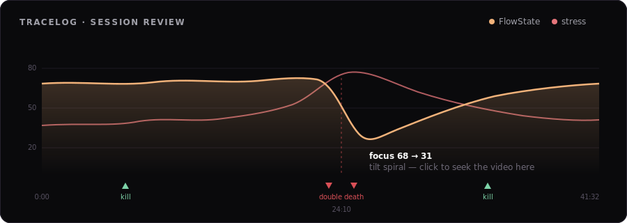

<p align="center">
  
</p>

<p align="center">
  <a href="https://github.com/enkhbold470/dota2-companion/releases/latest"></a>
  <a href="https://github.com/enkhbold470/dota2-companion/actions/workflows/ci.yml"></a>
  
  
</p>

**Sync your brain with your game.** NeuroFocus is a Dota 2 companion that coaches
you live while you play — and, with a NeuroFocus EEG headset, records your
**FlowState** (focus & stress) on top of every kill, death and teamfight, then
tells you exactly *where* your mental game broke and what to train next.

Read-only, advisory-only, local-first: it only listens to Valve's official Game
State Integration, binds to `127.0.0.1`, and your neural data never leaves your
machine.

## While you play

- 🧿 **Auto draft detect** — one screen grab of the top bar and AI vision reads
  all ten heroes, splits Radiant/Dire, and knows your allies from your enemies.
- ⚔️ **AI item builds** — hero-tuned, enemy-aware buy order with a
  **Meta ⇄ Fun 🎉** toggle. *Fun* pulls from a curated spicy pool for *your*
  hero; everything is priced against live gold with a **BUY NOW** flag.
- 💬 **Ask coach** — "why not BKB here?" answered with your full live context:
  economy, threats, timings.
- ⏱ **The fundamentals** — rune/Roshan/day-night timers, CS & GPM grades, skill
  damage readout, TP discipline nags. A deterministic engine — instant, every tick.
- 🧠 **FlowState strip** — your live focus score with **TiltGuard** warnings
  when you're spiraling.

## After you play — NeuroFocus Studio

Close the match and the app becomes a full-screen dashboard: your last game's
complete stat sheet (K/D/A, last hits & denies, GPM/XPM, damage, healing, final
items) and recent-match history via OpenDota — plus **TraceLog**, where your
recorded session meets the screen recording:

<p align="center">
  
</p>

Hit **Deep analysis** and NeuroFocus Intelligence reads the whole session —
every focus dip tied to what was happening in the game, your tilt signature,
and **one trainable habit** for next time. Every moment is a click that seeks
the video.

## Get started

1. **[Download the app](https://github.com/enkhbold470/dota2-companion/releases/latest)**
   (Windows installer / macOS) — it generates your GSI config and installs it
   into Dota automatically when it can find your Steam folder.
2. Add your OpenAI key in **Settings ⚙** to light up the AI features (item
   builds, vision, coach, deep analysis). Everything else works without it.
3. Play. Arm screen capture when prompted at draft — that powers both the auto
   hero detection and the video-synced review.

```
Dota 2 ──GSI──▶ local listener (:53000) ──WebSocket──▶ overlay / Studio
                     │                                      ▲
                     ├──▶ OpenAI gpt-5.4 (only on your click)│
                     └──▶ OpenDota (post-game stats, cached)─┘
```

<details>
<summary><strong>Run from source</strong></summary>

Requires Node ≥ 20 and pnpm.

```bash
corepack enable && pnpm install
pnpm gen-cfg              # generate the GSI .cfg + token (.gsi-token)
pnpm start                # one process: UI + API + WS → http://127.0.0.1:53000
```

Copy `gamestate_integration_dota2-companion.cfg` into
`…/dota 2 beta/game/dota/cfg/gamestate_integration/`. Put `GSI_TOKEN` (and
optionally `OPENAI_API_KEY`) in a repo-root `.env` — see `.env.example`. The
`.env` loads **with override**, so a globally-exported `OPENAI_API_KEY` can't
shadow the project key.

**Hot-reload dev loop** (three terminals — the third replays a recorded match
so you don't need Dota running):

```bash
GSI_TOKEN=$(cat .gsi-token) pnpm listener   # API/WS on :53000
pnpm overlay                                # Vite on :5273
GSI_TOKEN=$(cat .gsi-token) pnpm replay     # fake live match
```

</details>

<details>
<summary><strong>Patch day & data pipeline</strong></summary>

```bash
pnpm up dotaconstants && pnpm gen-data   # prune constants → checked-in JSON
pnpm gen-hero-builds                     # regenerate per-hero fun pools (needs OPENAI_API_KEY)
```

The engines run on ~250 KB of pruned static data (damage types, BKB pierce,
dispellability, item costs, OpenDota item-id map). `hero-builds.json` is an
LLM-curated fun pool per hero, validated against the item data. Both are
checked in; Settings shows which game patch the data was built from and flags
when the live patch is newer.

</details>

<details>
<summary><strong>Architecture & layout</strong></summary>

- `packages/shared` — all pure logic: GSI normalize, timers, economy, threat
  classification, counter-item engine, skill readout, coach tips, hero/item
  name matching, EEG DSP + FlowState scoring, session format, deep-analysis
  context builder. No I/O, fully unit-tested.
- `apps/listener` — Fastify GSI receiver + WebSocket fan-out, the gpt-5.4
  routes (`/coach`, `/item-build`, `/vision`, `/analysis`), the `/opendota`
  caching proxy, and local recording persistence. Serves the built overlay in
  prod (single process, single port).
- `apps/overlay` — React/Vite UI: the live coaching column + NeuroFocus Studio.
  A browser page, not an injected overlay.
- `apps/desktop` — Electron wrapper → one-click installers with auto-update.

The hot loop is deterministic on purpose: LLM calls fire only on explicit or
debounced user actions, never per GSI tick. CI runs `pnpm test` + `pnpm build`;
a `v*` tag builds and publishes the installers.

</details>

---

<p align="center"><sub>
Not affiliated with Valve. Dota 2 is a trademark of Valve Corporation.<br>
No memory reading · no input automation · no data leaves your machine
</sub></p>
